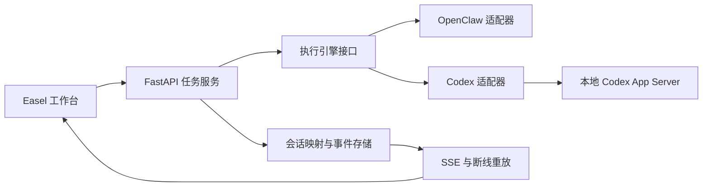

# Easel 接入 Codex 执行引擎计划

日期：2026-10-10（Asia/Shanghai）。评估基线：`0a241ba5`，源目录 `C:\project\Easel`，原分支 `codex/upstream-compat-2026-10-10`。本计划独立保存在 `codex/codex-runtime-plan-2026-10-10`。

状态：**规划完成，功能待实现**。用户先要求评估可行性，随后要求“可以啊，你规划一下吧”，并追加“思考过程也需要能够知道”。本轮交付计划、任务登记与文档同步；文中 API、文件及数据结构除明确说明的现有项外均为拟议设计。

## 1. 产品目标与首版范围

在 Easel 中新增可选的 **Codex 执行引擎**。用户仍在现有工作台中描述任务、查看回复与可见思考、处理操作确认、浏览产物；后台根据会话引擎选择 OpenClaw 或 Codex。

首版的完整路径为：选择 Codex → 检测运行环境 → 登录/配置 → 选择实际可用模型与思考档位 → 发送任务 → 流式查看文字、可见思考、命令和文件修改 → 必要时确认权限或追加指令 → 结束/停止 → 刷新后恢复记录。

首版必须交付 CX02–CX04 与 CX07。CX01 是启动实现前的技术门槛；技能完整适配、办公室多成员联动及便携发行按 CX05/CX06 后续推进。生图、视频、配音等独立媒体通道继续遵循自身 API 与任务协议，聊天引擎选项不自动改变这些通道。

## 2. 已核对的工程基础

| 现有位置 | 可复用内容 | 需要调整的依赖 |
| --- | --- | --- |
| `pyproject.toml` | Python ≥3.10、FastAPI、SSE、异步 HTTP | 增加经过验证的 Codex 可选运行依赖与版本锁 |
| `web/app.py` 的 `/api/chat/stream` | 后台 supervisor、会话锁、事件落盘、SSE 转发 | 当前直接依赖 OpenClaw 会话、网关、raw stream 和进程门面 |
| `/api/chat/jobs/{turn_id}/stream` 与 `/api/chat/last/{session_id}` | 事件重放和最终结果恢复 | 加入引擎/运行实例边界，明确重启后的不确定状态 |
| `web/frontend/src/lib/api.ts` 的 `streamChat` | `token`、`thinking`、`activity`、`question` 等事件消费 | 思考块、审批、引擎元数据及结构化操作事件 |
| `web/frontend/src/lib/store.ts`、`chatQueue.ts`、`chatSteering.ts` | 会话、草稿、队列、轮次快照 | 当前会话含 OpenClaw session key；引导采用停止后重新发送 |
| `web/chat_execution.py`、`web/agent_office.py`、`web/skill_audit.py` | 操作面板、场景展示、执行证据 | 当前读取 OpenClaw transcript/SQLite/toolResult，需独立数据源适配 |
| `web/local_config_import.py` | CC Switch 活跃 Codex provider 的配置解析、脱敏预览 | 目前是配置导入，不等于 Codex 智能体接入；OAuth 登录态有独立边界 |
| `web/usage_stats.py` | 用量归一与账本展示 | 数据来源是 Easel 自己的 OpenClaw 会话，需增加 Codex 用量来源 |

结论：前端与任务恢复基础可以复用，主要工程工作在执行后端、事件归一、状态隔离和技能证据适配。

## 3. 接入方式与版本门槛（CX01）

采用 **Codex App Server 协议**连接本地 Codex 运行时。FastAPI 保持为浏览器的唯一业务入口，由 Easel 管理后台进程、请求与事件分发。

优先验证官方 Python SDK：它与当前 Python 后端和最低 Python 版本匹配，并附带固定的运行时依赖。验证其是否覆盖流式通知、双向审批、问答、停止、引导、模型发现和会话恢复；通过后作为 Codex 适配器的实现。覆盖不足时选择轻量 `stdio` JSON-RPC 客户端。CX01 结束时确定一种首版实现，避免维护重复客户端。

官方文档将 App Server 命令和 WebSocket 传输标为实验性。首版采用本地 stdio 通信，不依赖浏览器直连或远程 WebSocket；锁定 CLI/SDK 版本及该版本生成的 JSON Schema。旧版、缺失或未知版本显示实际状态，不通过放宽能力判断来绕过。

CX01 产出：运行时版本矩阵、SDK 覆盖结论、协议 schema、事件样本、Windows 进程启动/退出记录和兼容边界。先通过离线协议服务及不生成内容的元数据检查；真实模型请求单独列为验收步骤。

## 4. 目标架构与代码落点

拟议文件与职责如下，最终名称在 CX01 后确定：

- `easel/runtimes/base.py`：统一的能力查询、启动/恢复会话、开始任务、事件订阅、停止、引导和交互回答接口。
- `easel/runtimes/openclaw.py`：封装现有调用路径，先沿用已有实现并用回归确认行为，再逐步抽取公共任务逻辑。
- `easel/runtimes/codex.py`：Codex 进程生命周期、异步消息分发、请求关联、通知消费和反向 RPC 请求处理。
- `web/runtime_routes.py`：运行环境检测、状态、登录、可用模型及交互回答接口。
- `web/chat_jobs.py` 与 `web/runtime_store.py`：逐步从 `web/app.py` 提取公共任务管理；持久保存会话映射、轮次、事件和待回答请求。
- 前端 `lib/chatRuntime.ts` 及现有共享模型选择/设置组件：引擎选择、能力驱动选项、请求快照和登录状态；沿用已有共享 Select、焦点和窄屏规则。

进程接收循环持续读取响应、通知和服务端请求。审批等待独立于接收循环，避免一轮等待用户回答时阻塞其他事件；阻塞 IO 不占用 FastAPI 事件循环。Windows 后台进程隐藏窗口，stdio 仅承载协议，stderr 用于受控日志。

## 5. 会话、队列与恢复契约（CX02）

建议的持久模型：

| 对象 | 核心字段与规则 |
| --- | --- |
| 会话 | `engine`、`runtimeProfileId`、`runtimeVersion`、`backendThreadId`、工作目录与配置版本；旧会话缺省为 `openclaw` |
| 轮次 | Easel `turnId`、后端 `backendTurnId`、模型/思考强度请求快照、实际回执、状态与错误 |
| 事件 | `eventId`、`sessionId`、`turnId`、`engine`、`itemId`、事件类型及有界 payload；先保存再发送 |
| 待交互请求 | 运行实例、请求 ID、会话/轮次、请求类型、公开内容、待答/已答/失效状态 |
| 队列消息 | 固定引擎、运行配置、模型、强度、技能、素材快照；编辑/重试保留明确来源 |

会话第一轮开始后固定执行引擎；切换引擎新建会话。用户已有草稿可明确复制，既有对话不冒充已迁移到另一运行时。旧备份兼容读取；导入备份保持只读历史语义，不直接绑定本机活跃 thread。

任务状态至少包含排队、启动、运行、等待交互、停止中、完成、失败、中断和状态未知。收到停止请求响应只代表请求被接受；以对应轮次的终态确认停止，随后释放锁和推进队列。错误、取消与完成保留各自语义。

浏览器断线仅断开显示订阅，任务继续，由 `eventId` 重放。服务重启后先读取持久映射、查询实际线程状态并核对当前轮次；活跃任务能否重新订阅由锁定版本实测确认。无法确认时显示状态未知/恢复受限，不重发原提示、不自动重新执行。最终历史与终态尽可能从受支持的 thread 读取 API 对账。

每次运行固定一组引擎、配置、模型和会话身份；失败时只显示该路径的错误。多个标签页、多个会话和不同引擎的事件严格隔离。一个运行配置使用一个受管进程；程序退出清理自己拥有的进程，避免影响用户另开的 Codex。

映射、事件和运行目录统一接入现有 `easel/paths.py` 与存储位置规则，支持用户选择的数据目录及便携模式。Codex 配置/凭据目录由运行配置显式确定，不自动改写用户现有 Codex 安装的个人配置；切换数据位置时对进行中任务保持明确限制。

## 6. 流式消息与可见思考（CX03 / CX07，首版必需）

**用户必须能知道模型公开返回的思考过程。** 产品展示范围是 Codex 实际返回的可见摘要/公开思考文本；可见摘要不等于完整内部推理。每轮分开展示思考、正文、工具执行和用户审批，避免把状态文字当成模型思考。

| Codex 数据 | Easel 处理 |
| --- | --- |
| `item/agentMessage/delta` | 追加正文；保留 item 与 phase，区分过程消息和最终答案 |
| `item/reasoning/summaryTextDelta` | 追加可见思考摘要；按轮次、item、摘要分段索引归属 |
| 思考分段/完成事件或最终 item | 按锁定 schema 合并最终快照，补齐未收到后缀，避免重复展示 |
| `item/started` / `item/completed` | 更新真实操作开始、完成、失败及相应证据 |
| `item/commandExecution/outputDelta` | 追加受控命令输出，进入已有操作详情 |
| 文件变更 item / diff 更新 | 保存真实变更记录和 diff，不根据请求猜增删行 |
| `thread/tokenUsage/updated` | 按实际字段记录用量，去重累计；费用及来源另行展示 |
| `turn/completed` 与错误通知 | 保存终态、错误及完整轮次快照；收到错误后继续正确处理终态 |
| 审批/提问的服务端请求 | 生成可回答的请求卡片，答案关联原请求 ID |

CX07 的交互和验收要求：

1. 思考区随真实摘要增量更新，可折叠/展开，运行结束后仍可查看；刷新、离开再进入及断线重连保留已接收内容。
2. 保留摘要分段和原有次序；同一轮多段思考、多个工具往返分别显示，不能混入前一轮或另一会话。
3. 明确区分“等待可见摘要”“正在接收可见思考”“本轮未提供可见思考”“已有思考，任务被中断/失败”。遇到失败保留已取得片段及真实错误。
4. 只有公开可读文本进入显示。加密内容、签名及任意未知对象不转成文字；无摘要时不生成替代思考。
5. UI 请求的思考强度与返回的可见摘要分别记录。选择高强度不能证明模型返回更多摘要；档位依据当前引擎/模型能力生成。
6. 明确“观察到的摘要持续时间”和任务耗时，只有真实事件能支撑的时间才显示；不把首个文字出现时间推断成完整内部思考耗时。
7. 后端保留块结构和正文最终快照，现有 `thinking` 字符串作为兼容投影。事件回放与最终快照对账避免重复、漏字和无界内存增长。
8. 桌面/390px、键盘展开、复制、长文本滚动、进行中与无摘要状态逐项真实浏览器检查。推理展示只覆盖模型和运行时确实公开返回的部分。

## 7. 登录、模型与操作控制（CX03 / CX04）

设置页增加紧凑的 Codex 区域，展示未安装、版本不兼容、未登录、就绪或故障及明确下一步。支持运行时实际提供的 ChatGPT 登录与 API Key 方式；凭据由受支持的本地凭据机制管理，浏览器只接收状态和脱敏信息。

引擎、渠道、模型分别存储。模型菜单使用实际模型发现/已验证配置；不能枚举时允许明确输入模型 ID 并显示未验证状态。Codex 自定义渠道按当前 Responses 协议要求核验，现有 Anthropic 或 Chat Completions 渠道不自动认作兼容。CC Switch 仅导入用户确认的配置字段，不复制 OAuth 会话；Codex 使用自己的登录流程。

`model/list` 等能力回执驱动模型与思考档位选择。跨引擎切换清理不适用的临时选项并保留各自偏好；例如 OpenClaw 的 `adaptive` 等档位不能未经验证传给 Codex。实际运行模型无法核实则显示未确认。

首版操作控制同时交付：

- **停止**：调用对应 thread/turn 的 `turn/interrupt`，保持停止中状态直到终态确认。
- **当前轮引导**：调用 `turn/steer`，收到相同活跃轮次的接受回执后标记送达；该接口不带模型、工作目录或权限覆盖。待发消息含冲突设置时保留为下一轮，避免默默丢弃设置。
- **问答与审批**：按锁定 schema 分别处理提问、命令、文件修改和权限请求；实验性问答能力由能力位驱动。卡片保持请求身份，回答失败可恢复，过期/已停止请求不能再次提交。
- **权限**：默认工作区及输出目录依据用户选择的数据目录设置。读写/网络请求由实际权限策略约束；拒绝、取消和超时有明确行为，不能为了跑通而自动接受所有审批。
- **执行记录**：结构化呈现命令、状态、耗时、输出及变更；日志、预览和 diff 延续现有敏感字段脱敏与内容限制。

## 8. 技能与办公室（CX05）

按现有技能逐个建立兼容清单：提示/说明、独立 Python/Node/命令脚本、MCP 工具、OpenClaw 专有工具、登录与发布、素材生成。记录依赖、实际调用方式、可支持的引擎和验证证据。

优先复用离线读取、文本处理及本地产物脚本。OpenClaw 专有问答、子 Agent、会话工具通过 Codex 的原生能力或受控 MCP 适配。平台注册与真实发布保持原有业务入口和确认语义，不因为换引擎增加自动投稿。

选择技能后，使用 Codex 受支持的技能发现/显式选择机制或经过验证的包装；“用户选择了技能”和“运行时确实读取/执行了技能”分别展示。工作目录、素材、用户画像、脚本路径和输出目录都要适配；只传入有权限的材料，输出进入 Easel 内容库。

办公室先支持一个真实主 Agent 与相应操作、状态和产物。仅在 Codex 返回可信的子 Agent 身份及关联关系时创建真实成员；场景预设角色仍属于展示。办公室、执行记录、用量和技能核验统一关联同一会话/轮次。暂不支持的控制明确标记，不能将 OpenClaw RPC 发往 Codex。

## 9. 分阶段实施与退出条件

| 阶段 | 任务 | 交付物与退出条件 | 相对工作量 |
| --- | --- | --- | --- |
| CX01 | 锁定 SDK/CLI、schema、stdio 和必要能力 | 一条客户端实现路线；事件/审批/引导/恢复覆盖矩阵；离线及元数据检查记录 | 小 |
| CX02 | 引擎接口、身份映射、受管进程、任务事件存储 | 旧会话正常；多会话隔离；重复事件/断线/进程异常可恢复且不重复执行 | 中 |
| CX03 + CX07 | 登录、模型/强度、流式正文与可见思考 | 从配置到回复闭环；思考增量/分段/持久化/未提供状态，桌面和390px可用 | 中 |
| CX04 | 审批、工具/diff、停止、同轮引导、用量 | 拒绝/取消/过期请求正确；停止终态确认；引导身份一致；操作记录真实可追溯 | 中至大 |
| CX05 | 技能、画像/素材、内容库与办公室 | 技能兼容矩阵；主 Agent 联动；真实子 Agent 仅凭实际证据映射 | 大，取决于技能范围 |
| CX06 | Windows 运行依赖、可选安装、发行与交接 | 锁定依赖、干净数据启停、包内隐私检查、干净Windows结果及用户验收记录 | 中 |

CX02–CX04/CX07 完成后交付源码首版预览，CX05/CX06 单独跟踪。阶段中发现未知能力先形成可重现记录，再收窄或补齐范围；后续排期以 CX01 的实际覆盖结果估算。

CX03 属于受控开发预览；交互请求处理与权限策略在 CX04 完成并验证后，才开放首版完整任务执行。首版验收以整个闭环为门槛，不以单独出现流式文字作为完成依据。

## 10. 验证与证据分层

离线协议回归覆盖有风险的状态行为：跨会话串流、碎片/重复事件、思考块合并、EOF 无终态、服务端退出、审批等待与拒绝、重复回答、停止竞争、引导接受后丢连接、事件恢复、旧会话/备份/队列兼容及脱敏。使用临时目录，不读写用户真实会话或登录文件。

UI 验收逐项列出设置入口、登录状态、引擎/模型/强度菜单、发送、思考展开、操作详情、审批、停止、引导、刷新恢复、内容库及办公室跳转。真实浏览器桌面与390px分别记录；HTTP 可达性、受控数据与真实后端证据独立标注。

真实 Codex 验收使用隔离工作目录：产生一段文字与运行时提供的可见摘要，读取样本、修改样本、运行无副作用命令、处理一次可控审批、追加同轮指令和显式停止。逐项核对事件、后端状态和磁盘结果。真实调用涉及账号用量，实施阶段遵循用户当时的调用授权；本规划不触发调用或扩大既有发布授权。

恢复需要分别检查浏览器断线、前端刷新、FastAPI 重启、Codex 进程退出和整机重启。任何场景恢复不了活跃任务时给出明确状态，不将历史记录可读当作任务已继续运行。

发行检查包括 Python SDK/CLI 依赖与许可文件、可选安装及版本检测、包含中文/空格的路径、隐藏后台窗口、正常退出/再次启动、数据目录迁移、包内不含凭据和个人输出。单机开发环境结果不代替干净 Windows。

## 11. 回退与交付状态

Codex 功能使用独立开关和运行配置。关闭后新的默认会话继续使用现有 OpenClaw；已有 Codex 历史仍可读取，活跃任务先明确结束。模式切换不会自动把未完成任务发到另一引擎。

本轮已完成源码定位、官方协议核对、CX01–CX07 规划与用户清单登记。实现、真实调用、浏览器新增功能验收、安装依赖和发行均待后续阶段。原有交付记录及所有未完成项继续保留。

## 官方依据（2026-10-10 已实际读取）

- [Codex SDK](https://developers.openai.com/codex/sdk/)：自动化定位、Python SDK、最低版本与附带固定运行时。
- [Codex App Server](https://developers.openai.com/codex/app-server/)：自定义客户端定位、stdio/JSON-RPC、实验性状态、会话/事件/审批/引导及停止。
- [Authentication](https://developers.openai.com/codex/auth/)：ChatGPT 登录与 API Key 的账号、用量及功能边界。
- [Configuration Reference](https://developers.openai.com/codex/config-reference/)：自定义 provider、Responses 协议及配置项。
- [Open Source](https://developers.openai.com/codex/open-source)：CLI、SDK、App Server 等开源组件范围。
